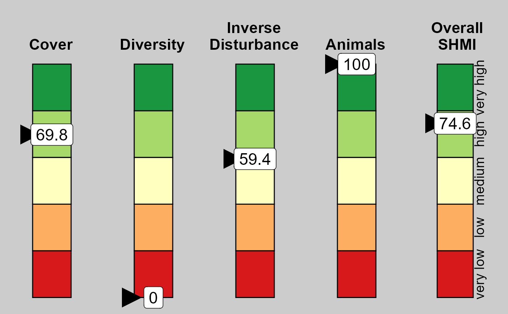
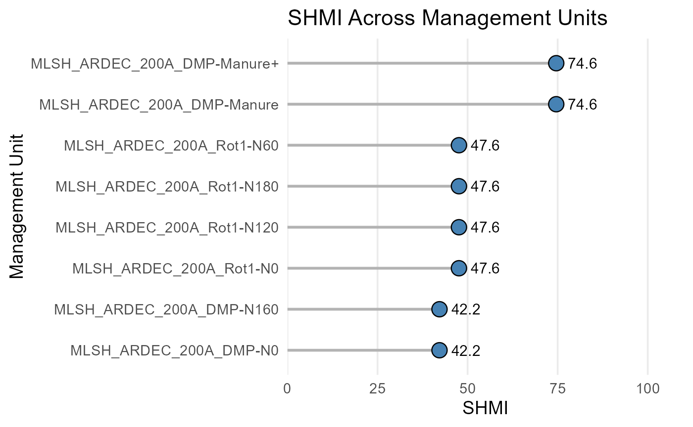

# SHMI Overview

``` r
library(SHMI)
```

## Introduction

The Soil Health Management Index (SHMI) provides a quantitative,
rotation‑scale assessment of soil health management practices. It
integrates four biologically grounded sub-indices:

- **Cover** — seasonal plant presence  
- **Diversity** — rotation-scale crop diversity (Hill numbers)  
- **Inverse Disturbance** — mechanistic mixing-efficiency × depth
  metric  
- **Organic Inputs** — amendments and animal presence

This vignette provides a complete walk-through of the SHMI workflow
using the functions in the SHMI R package.

------------------------------------------------------------------------

### Quick Start

### 📘 Minimal Example

A complete SHMI workflow in just a few lines

``` r
library(SHMI)

# 1. Retrieve the sample Excel file
example <- get_shmi_example()

# 2. Prepare inputs (validates structure and expands events)
df <- prepare_shmi_inputs(example)
#> ✅ Excel input validation passed.
#> Input summary:
#> # A tibble: 1 × 6
#>   sheets_present mgt_units crop_rows disturbance_rows amendment_rows animal_rows
#>            <int>     <int>     <int>            <int>          <int>       <int>
#> 1              5       100        40              500             35           0
#> Excluding 0 management units:
#>   -
#> 
#> Included 8 management units for sheet Mgt_Unit:
#>   - MLSH_ARDEC_200A_DMP-N0
#>   - MLSH_ARDEC_200A_DMP-Manure
#>   - MLSH_ARDEC_200A_DMP-N160
#>   - MLSH_ARDEC_200A_DMP-Manure+
#>   - MLSH_ARDEC_200A_Rot1-N0
#>   - MLSH_ARDEC_200A_Rot1-N60
#>   - MLSH_ARDEC_200A_Rot1-N120
#>   - MLSH_ARDEC_200A_Rot1-N180
#> Sheet 'Animal_Diversity' is empty; returning empty tibble.

# 3. Compute sub-index scores and SHMI
result <- build_shmi(df)
#> ✅ SHMI input validation passed.
#> SHMI computed using official national settings.

head(result)
#> $indicator_df
#> # A tibble: 8 × 6
#>   MGT_combo                    SHMI Cover Diversity InvDist Animals
#>   <chr>                       <dbl> <dbl>     <dbl>   <dbl>   <dbl>
#> 1 MLSH_ARDEC_200A_DMP-Manure   74.6  69.8         0    59.4     100
#> 2 MLSH_ARDEC_200A_DMP-Manure+  74.6  69.8         0    59.4     100
#> 3 MLSH_ARDEC_200A_DMP-N0       42.2  69.8         0    59.4       0
#> 4 MLSH_ARDEC_200A_DMP-N160     42.2  69.8         0    59.4       0
#> 5 MLSH_ARDEC_200A_Rot1-N0      47.6  70.1         0   100         0
#> 6 MLSH_ARDEC_200A_Rot1-N120    47.6  70.1         0   100         0
#> 7 MLSH_ARDEC_200A_Rot1-N180    47.6  70.1         0   100         0
#> 8 MLSH_ARDEC_200A_Rot1-N60     47.6  70.1         0   100         0
#> 
#> $settings_used
#> $settings_used$w_winter
#> [1] 0.13
#> 
#> $settings_used$w_spring
#> [1] 0.129
#> 
#> $settings_used$w_summer
#> [1] 0.513
#> 
#> $settings_used$w_fall
#> [1] 0.227
#> 
#> $settings_used$hill
#> [1] 2
#> 
#> $settings_used$max_div
#> [1] 8
#> 
#> $settings_used$w_amend
#> [1] 1
#> 
#> $settings_used$w_animals
#> [1] 1
#> 
#> $settings_used$w_cover
#> [1] 0.492
#> 
#> $settings_used$w_div
#> [1] 0.052
#> 
#> $settings_used$w_dist
#> [1] 0.131
#> 
#> $settings_used$w_ani
#> [1] 0.324
#> 
#> 
#> $expert_mode
#> [1] FALSE
#> 
#> $shmi_version
#> [1] "1.0.2"
#> 
#> $timestamp
#> [1] "2026-04-16 14:29:12 MDT"

# 4. Plot the results
# Plot the first management unit
plot_shmi_gauge(result$indicator_df, row = 1)
```



``` r

# Plot all available management units
plot_shmi_lollipop(result$indicator_df)
```



------------------------------------------------------------------------

### Detailed Instructions

## 1. Preparing Inputs

The SHMI workflow begins with a standardized Excel workbook containing:

- `Mgt_Unit`  
- `Crop_Diversity`  
- `Soil_Disturbance`  
- `Amendment_Diversity`  
- `Animal_Diversity`

The function
[`prepare_shmi_inputs()`](https://danielmanter-usda.github.io/SHMI/reference/prepare_shmi_inputs.md):

- reads and validates all sheets  
- harmonizes crop windows  
- constructs rotation bounds  
- builds daily grids  
- computes daily disturbance  
- assembles amendment and animal events

``` r
# Example (replace with your file path)
example_file <- SHMI::get_shmi_example()

inputs <- prepare_shmi_inputs(example_file, verbose = TRUE)
#> ✅ Excel input validation passed.
#> Input summary:
#> # A tibble: 1 × 6
#>   sheets_present mgt_units crop_rows disturbance_rows amendment_rows animal_rows
#>            <int>     <int>     <int>            <int>          <int>       <int>
#> 1              5       100        40              500             35           0
#> Excluding 0 management units:
#>   -
#> 
#> Included 8 management units for sheet Mgt_Unit:
#>   - MLSH_ARDEC_200A_DMP-N0
#>   - MLSH_ARDEC_200A_DMP-Manure
#>   - MLSH_ARDEC_200A_DMP-N160
#>   - MLSH_ARDEC_200A_DMP-Manure+
#>   - MLSH_ARDEC_200A_Rot1-N0
#>   - MLSH_ARDEC_200A_Rot1-N60
#>   - MLSH_ARDEC_200A_Rot1-N120
#>   - MLSH_ARDEC_200A_Rot1-N180
#> Sheet 'Animal_Diversity' is empty; returning empty tibble.
```

The returned object is a named list containing:

- `rot_bounds`  
- `crop_harmonized`  
- `daily`  
- `daily_dist`  
- `amend`  
- `animal`  
- and additional metadata

These objects feed directly into
[`build_shmi()`](https://danielmanter-usda.github.io/SHMI/reference/build_shmi.md).

------------------------------------------------------------------------

## 2. Computing SHMI

Once inputs are prepared, computing SHMI is straightforward:

``` r
shmi <- build_shmi(inputs)
#> ✅ SHMI input validation passed.
#> SHMI computed using official national settings.

shmi$indicator_df
#> # A tibble: 8 × 6
#>   MGT_combo                    SHMI Cover Diversity InvDist Animals
#>   <chr>                       <dbl> <dbl>     <dbl>   <dbl>   <dbl>
#> 1 MLSH_ARDEC_200A_DMP-Manure   74.6  69.8         0    59.4     100
#> 2 MLSH_ARDEC_200A_DMP-Manure+  74.6  69.8         0    59.4     100
#> 3 MLSH_ARDEC_200A_DMP-N0       42.2  69.8         0    59.4       0
#> 4 MLSH_ARDEC_200A_DMP-N160     42.2  69.8         0    59.4       0
#> 5 MLSH_ARDEC_200A_Rot1-N0      47.6  70.1         0   100         0
#> 6 MLSH_ARDEC_200A_Rot1-N120    47.6  70.1         0   100         0
#> 7 MLSH_ARDEC_200A_Rot1-N180    47.6  70.1         0   100         0
#> 8 MLSH_ARDEC_200A_Rot1-N60     47.6  70.1         0   100         0
```

The output includes:

- **Cover**  
- **Diversity**  
- **InvDist**  
- **Animals**  
- **SHMI** (weighted composite)

as well as:

- `settings_used`  
- `expert_mode`  
- `timestamp`  
- `shmi_version`

------------------------------------------------------------------------

## 3. Expert Mode

By default, SHMI uses the official national settings (locked mode). To
explore scenarios or conduct research, you may override settings:

``` r

custom <- list(
    # cover
    w_winter = 0.25,
    w_spring = 0.25,
    w_summer = 0.25,
    w_fall   = 0.25,

    # diversity
    hill      = 2,
    max_div   = 8,

    # SHMI weights
    w_cover    = 0.25,
    w_div      = 0.25,
    w_dist     = 0.25,
    w_ani      = 0.25
)

shmi_exp <- build_shmi(inputs, settings = custom, expert_mode = TRUE)
#> ✅ SHMI input validation passed.
#> Expert mode enabled: SHMI scores will NOT be comparable to the national SHMI scale.
```

When `expert_mode = TRUE`, SHMI values are not comparable to the
national SHMI scale.

------------------------------------------------------------------------

## 4. Sub-Index Details

This section demonstrates how each sub-index is computed individually.

### 4.1 Cover

``` r
compute_cover(inputs$daily, inputs$rot_bounds)
#> # A tibble: 8 × 2
#>   MGT_combo                   Cover
#>   <chr>                       <dbl>
#> 1 MLSH_ARDEC_200A_DMP-Manure   69.8
#> 2 MLSH_ARDEC_200A_DMP-Manure+  69.8
#> 3 MLSH_ARDEC_200A_DMP-N0       69.8
#> 4 MLSH_ARDEC_200A_DMP-N160     69.8
#> 5 MLSH_ARDEC_200A_Rot1-N0      70.1
#> 6 MLSH_ARDEC_200A_Rot1-N120    70.1
#> 7 MLSH_ARDEC_200A_Rot1-N180    70.1
#> 8 MLSH_ARDEC_200A_Rot1-N60     70.1
```

Cover is based on seasonal plant-days, normalized by rotation length and
weighted by seasonal importance.

------------------------------------------------------------------------

### 4.2 Diversity

``` r
compute_diversity(inputs$crop_harmonized, inputs$daily)
#> # A tibble: 8 × 4
#>   MGT_combo                       D Diversity_raw Diversity
#>   <chr>                       <dbl>         <dbl>     <dbl>
#> 1 MLSH_ARDEC_200A_DMP-Manure      0             0         0
#> 2 MLSH_ARDEC_200A_DMP-Manure+     0             0         0
#> 3 MLSH_ARDEC_200A_DMP-N0          0             0         0
#> 4 MLSH_ARDEC_200A_DMP-N160        0             0         0
#> 5 MLSH_ARDEC_200A_Rot1-N0         0             0         0
#> 6 MLSH_ARDEC_200A_Rot1-N120       0             0         0
#> 7 MLSH_ARDEC_200A_Rot1-N180       0             0         0
#> 8 MLSH_ARDEC_200A_Rot1-N60        0             0         0
```

Diversity uses Hill-number entropy metrics at the rotation scale, with
mixture expansion and species-level plant-day aggregation.

------------------------------------------------------------------------

### 4.3 Inverse Disturbance

``` r
compute_disturbance(inputs$daily_dist, inputs$rot_bounds)
#> # A tibble: 8 × 2
#>   MGT_combo                   InvDist
#>   <chr>                         <dbl>
#> 1 MLSH_ARDEC_200A_DMP-Manure     59.4
#> 2 MLSH_ARDEC_200A_DMP-Manure+    59.4
#> 3 MLSH_ARDEC_200A_DMP-N0         59.4
#> 4 MLSH_ARDEC_200A_DMP-N160       59.4
#> 5 MLSH_ARDEC_200A_Rot1-N0       100  
#> 6 MLSH_ARDEC_200A_Rot1-N120     100  
#> 7 MLSH_ARDEC_200A_Rot1-N180     100  
#> 8 MLSH_ARDEC_200A_Rot1-N60      100
```

Disturbance is computed using a mechanistic mixing-efficiency × depth
model:

- cumulative mechanical energy  
- profile penetration (Tₜ)  
- annual aggregation  
- rotation averaging  
- scaling to 0–100

------------------------------------------------------------------------

### 4.4 Organic Inputs

``` r
compute_orginput(inputs$rot_bounds, inputs$amend, inputs$animal)
#> # A tibble: 8 × 3
#>   MGT_combo                   events_per_year Animals
#>   <chr>                                 <dbl>   <dbl>
#> 1 MLSH_ARDEC_200A_DMP-Manure                1     100
#> 2 MLSH_ARDEC_200A_DMP-Manure+               1     100
#> 3 MLSH_ARDEC_200A_DMP-N0                    0       0
#> 4 MLSH_ARDEC_200A_DMP-N160                  0       0
#> 5 MLSH_ARDEC_200A_Rot1-N0                   0       0
#> 6 MLSH_ARDEC_200A_Rot1-N120                 0       0
#> 7 MLSH_ARDEC_200A_Rot1-N180                 0       0
#> 8 MLSH_ARDEC_200A_Rot1-N60                  0       0
```

Organic inputs combine amendment and animal events using user-defined
weights.

------------------------------------------------------------------------

## 5. Interpreting SHMI

The final SHMI score reflects:

- year-round cover  
- crop diversity  
- reduced soil disturbance  
- organic inputs

Higher SHMI values indicate management systems that are more supportive
of soil health.

------------------------------------------------------------------------

## Conclusion

The SHMI package provides a fast, reproducible, and biologically
grounded framework for quantifying soil health management across diverse
systems.

For more details, see:

- [`?prepare_shmi_inputs`](https://danielmanter-usda.github.io/SHMI/reference/prepare_shmi_inputs.md)  
- [`?build_shmi`](https://danielmanter-usda.github.io/SHMI/reference/build_shmi.md)  
- [`?compute_cover`](https://danielmanter-usda.github.io/SHMI/reference/compute_cover.md)  
- [`?compute_diversity`](https://danielmanter-usda.github.io/SHMI/reference/compute_diversity.md)  
- [`?compute_disturbance`](https://danielmanter-usda.github.io/SHMI/reference/compute_disturbance.md)  
- [`?compute_orginput`](https://danielmanter-usda.github.io/SHMI/reference/compute_orginput.md)
