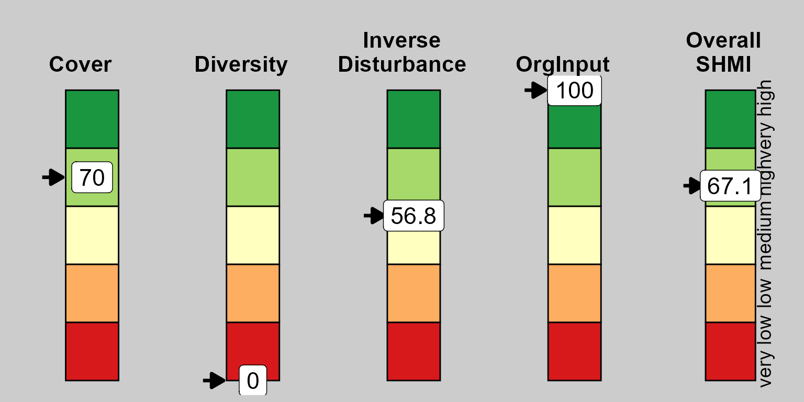
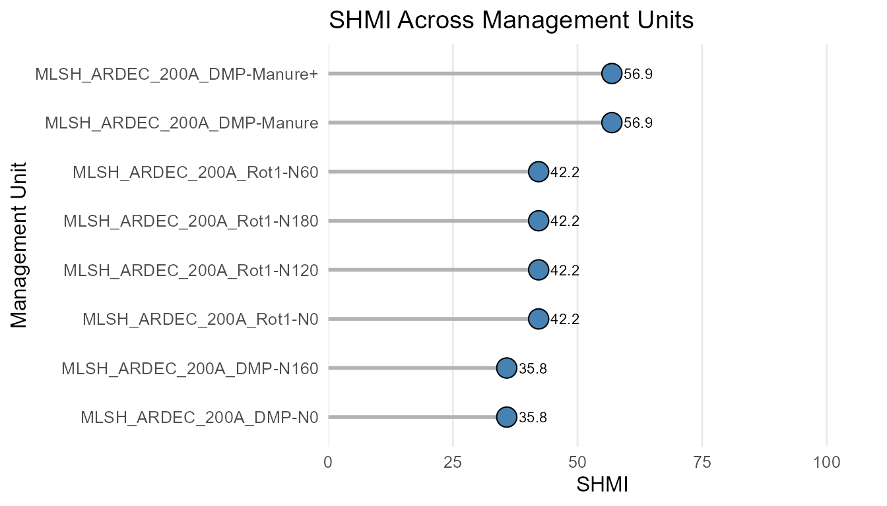

# SHMI Overview

## Introduction

The Soil Health Management Index (SHMI) turns a record of field
management into a single 0-100 score. It combines four sub-indices, each
also scored 0-100:

- **Cover**: the season-weighted share of days with living plants.
- **Diversity**: how many crop species were grown, and how evenly, over
  the rotation.
- **Inverse disturbance (InvDist)**: how little the soil was tilled; 100
  means no disturbance.
- **Organic inputs (OrgInput)**: how often organic amendments were
  applied and animals were present.

This vignette walks through the standard workflow: fill in the Excel
workbook, prepare the inputs, compute SHMI, and review the results.

``` r
library(SHMI)
```

## 1. Get a workbook

SHMI reads a standard Excel workbook. Start from the blank template, or
from a completed example to see how entries should look:

``` r
download_shmi_template("SHMI_template.xlsx")  # blank
download_shmi_example()                       # completed example
```

The completed example is also installed with the package, and
[`get_shmi_example()`](https://danielmanter-usda.github.io/SHMI/reference/get_shmi_example.md)
returns its path. The rest of this vignette uses it: eight management
units from a long-term experiment (2020-2024), with continuous corn and
a rotation under several nitrogen and manure treatments.

The workbook has one sheet per kind of record, each with column names on
the fourth row:

| Sheet | Records |
|----|----|
| `Mgt_Unit` | Management units (`MGT_combo`), with study, farm, field, and treatment |
| `Crop_Diversity` | Crops: name, category, and plant, harvest, and termination dates |
| `Soil_Disturbance` | Tillage and other soil-disturbing passes |
| `Soil_Amendments` | Amendments, including organic inputs |
| `Animal_Diversity` | Periods with grazing or other animals |

The disturbance, amendment, and animal sheets may be left empty. Each
crop is entered by name with its dates; mixtures are entered as one row
per species. Sequence numbers (`CD_seq_num`) and mixture flags
(`CD_mix`) are not needed.

## 2. Prepare the inputs

``` r
inputs <- prepare_shmi_inputs("my_SHMI_inputs.xlsx")   # your own workbook
```

With the installed example:

``` r
inputs <- prepare_shmi_inputs(get_shmi_example(), verbose = FALSE)
names(inputs)
#> [1] "rot_bounds"  "mgt"         "crop"        "dist"        "amend"      
#> [6] "animal"      "yield"       "n_rate"      "assumptions"
head(inputs$crop)
#> # A tibble: 6 × 8
#>   MGT_combo        episode_id CD_cat CD_name crop_start crop_end   start_imputed
#>   <chr>                 <int> <chr>  <chr>   <date>     <date>     <lgl>        
#> 1 MLSH_ARDEC_200A…          1 Annual Corn    2020-04-27 2020-10-13 FALSE        
#> 2 MLSH_ARDEC_200A…          2 Annual Corn    2021-05-08 2021-10-20 FALSE        
#> 3 MLSH_ARDEC_200A…          3 Annual Corn    2022-04-27 2022-10-20 FALSE        
#> 4 MLSH_ARDEC_200A…          4 Annual Corn    2023-04-24 2023-10-23 FALSE        
#> 5 MLSH_ARDEC_200A…          5 Annual Corn    2024-05-01 2024-10-22 FALSE        
#> 6 MLSH_ARDEC_200A…          1 Annual Corn    2020-04-27 2020-10-13 FALSE        
#> # ℹ 1 more variable: end_imputed <lgl>
```

[`prepare_shmi_inputs()`](https://danielmanter-usda.github.io/SHMI/reference/prepare_shmi_inputs.md):

1.  **Validates the workbook** with
    [`validate_excel_input()`](https://danielmanter-usda.github.io/SHMI/reference/validate_excel_input.md)
    and stops with a list of problems if, for example, a required sheet
    or column is missing, a unit is not listed in `Mgt_Unit`, or a
    disturbance pass has no date.
2.  **Builds crop episodes**: one row per species per continuous period
    of presence. Mixtures, relays, and intercrops are simply overlapping
    episodes. Harvest rows without a plant date are attached to a
    standing perennial as cuttings.
3.  **Fills in missing dates**, following fixed rules. A crop with no
    plant date starts where the previous crop ended, or at the start of
    the record. A crop with no end date ends at the next planting, or at
    the end of the record.
4.  **Sets the rotation window** from the first to the last recorded
    event.

It returns a list:

| Element | Contents |
|----|----|
| `rot_bounds` | Rotation start and end for each unit |
| `mgt` | Management-unit details |
| `crop` | Species episodes, with `crop_start` and `crop_end` |
| `dist`, `amend`, `animal` | Disturbance, amendment, and animal events |
| `yield`, `n_rate` | Yields and nitrogen rates, if requested |
| `assumptions` | Every date that was filled in, and every value to review |

### Reviewing assumptions

Management records are rarely complete, particularly at the start and
end of a record kept by calendar year. Rather than filling gaps
silently,
[`prepare_shmi_inputs()`](https://danielmanter-usda.github.io/SHMI/reference/prepare_shmi_inputs.md)
records each assumption:

``` r
table(inputs$assumptions$type)
#> < table of extent 0 >

# Items flagged for review, such as a perennial species entered as an annual
subset(inputs$assumptions, level == "check")
#> # A tibble: 0 × 8
#> # ℹ 8 variables: MGT_combo <chr>, source <chr>, name <chr>, date_start <date>,
#> #   date_end <date>, level <chr>, type <chr>, message <chr>
```

Rows with `level == "assumption"` are routine gap-filling. Rows with
`level == "check"` usually point to a data-entry issue worth correcting
in the workbook.
[`?prepare_shmi_inputs`](https://danielmanter-usda.github.io/SHMI/reference/prepare_shmi_inputs.md)
describes each type.

### Choosing the evaluation window

By default the rotation runs from the first to the last recorded event
for each unit. To score a fixed period instead, give start and end
dates; events outside the window are dropped, and crops and grazing
periods are clipped to it:

``` r
inputs_2022_23 <- prepare_shmi_inputs(
  get_shmi_example(), verbose = FALSE,
  start_date_override = "2022-01-01",
  end_date_override   = "2023-12-31"
)
inputs_2022_23$rot_bounds
#> # A tibble: 8 × 5
#>   MGT_combo                   rot_start  rot_end    rot_start_yr rot_end_yr
#>   <chr>                       <date>     <date>            <dbl>      <dbl>
#> 1 MLSH_ARDEC_200A_DMP-Manure  2022-04-08 2023-10-23         2022       2023
#> 2 MLSH_ARDEC_200A_DMP-Manure+ 2022-04-08 2023-10-23         2022       2023
#> 3 MLSH_ARDEC_200A_DMP-N0      2022-04-08 2023-10-23         2022       2023
#> 4 MLSH_ARDEC_200A_DMP-N160    2022-04-08 2023-10-23         2022       2023
#> 5 MLSH_ARDEC_200A_Rot1-N0     2022-04-27 2023-10-23         2022       2023
#> 6 MLSH_ARDEC_200A_Rot1-N120   2022-04-27 2023-10-23         2022       2023
#> 7 MLSH_ARDEC_200A_Rot1-N180   2022-04-27 2023-10-23         2022       2023
#> 8 MLSH_ARDEC_200A_Rot1-N60    2022-04-27 2023-10-23         2022       2023
```

Other options include `exclude` (leave out some units),
`end_at_sample_date` (stop each unit at its soil sampling date), and
`calc_yield` / `calc_n_rate` (also return yields in kg/ha and annual
nitrogen rates).

## 3. Compute SHMI

``` r
result <- build_shmi(inputs)
result$indicator_df
#> # A tibble: 8 × 10
#>   MGT_combo   MGT_study MGT_farm MGT_field MGT_trt  SHMI Cover Diversity InvDist
#>   <chr>       <chr>     <chr>    <chr>     <chr>   <dbl> <dbl>     <dbl>   <dbl>
#> 1 MLSH_ARDEC… MLSH      ARDEC    200A      DMP-Ma…  57.9  64.5         0    55.1
#> 2 MLSH_ARDEC… MLSH      ARDEC    200A      DMP-Ma…  57.9  64.5         0    55.1
#> 3 MLSH_ARDEC… MLSH      ARDEC    200A      DMP-N0   36.8  64.5         0    55.1
#> 4 MLSH_ARDEC… MLSH      ARDEC    200A      DMP-N1…  36.8  64.5         0    55.1
#> 5 MLSH_ARDEC… MLSH      ARDEC    200A      Rot1-N0  43.4  64.9         0   100  
#> 6 MLSH_ARDEC… MLSH      ARDEC    200A      Rot1-N…  43.4  64.9         0   100  
#> 7 MLSH_ARDEC… MLSH      ARDEC    200A      Rot1-N…  43.4  64.9         0   100  
#> 8 MLSH_ARDEC… MLSH      ARDEC    200A      Rot1-N…  43.4  64.9         0   100  
#> # ℹ 1 more variable: OrgInput <dbl>
```

`indicator_df` has one row per management unit, with `SHMI`, `Cover`,
`Diversity`, `InvDist`, and `OrgInput`, plus the unit’s study, farm,
field, and treatment. The result also records `settings_used`,
`expert_mode`, `shmi_version`, and a `timestamp`, so every score can be
traced to how it was computed.

By default,
[`build_shmi()`](https://danielmanter-usda.github.io/SHMI/reference/build_shmi.md)
uses the official national settings. These include the **EPA**
soil-mixing model for disturbance, which needs a tillage depth
(`SD_depth`, in inches) for every pass. If your data record STIR values
instead of depths, use expert mode (next section) with
`dist_meth = "STIR"`.

## 4. Expert mode

For research or scenario analysis, any setting can be changed. Settings
you do not supply keep their official values:

``` r
# Score disturbance with STIR instead of the EPA model
result_stir <- build_shmi(
  inputs,
  settings    = list(dist_meth = "STIR"),
  expert_mode = TRUE
)

# Equal weights throughout
custom <- list(
  w_winter = 0.25, w_spring = 0.25, w_summer = 0.25, w_fall = 0.25,  # cover
  hill = 2, max_div = 16,                                            # diversity
  dist_meth = "STIR", max_stir = 400, ti_rep = "mid",                # disturbance
  w_amend = 0.5, w_animal = 0.5,                                     # organic inputs
  w_cover = 0.25, w_diversity = 0.25, w_invdist = 0.25,              # SHMI weights
  w_orginput = 0.25
)
result_custom <- build_shmi(inputs, settings = custom, expert_mode = TRUE)
```

Setting names must match exactly;
[`?build_shmi`](https://danielmanter-usda.github.io/SHMI/reference/build_shmi.md)
lists them with their official values. Scores computed in expert mode
are **not comparable** to the national SHMI scale.

## 5. How missing records are scored

SHMI treats a missing record as a practice that did not happen:

- **No disturbance records** means no tillage, so InvDist = 100. This is
  how continuous no-till is represented.
- **No crop on a given day** means no cover that day. A fallow reference
  site scores Cover = 0 and Diversity = 0.
- **No amendment or animal records** means no organic inputs, so
  OrgInput = 0.

Record every tillage pass, planting, harvest, and amendment for the
period being evaluated, so that gaps in the records are not mistaken for
practices.

## 6. The sub-indices one at a time

Each sub-index can be computed directly from the prepared inputs:

``` r
compute_cover(inputs$crop, inputs$rot_bounds)
#> # A tibble: 8 × 2
#>   MGT_combo                   Cover
#>   <chr>                       <dbl>
#> 1 MLSH_ARDEC_200A_DMP-Manure   64.5
#> 2 MLSH_ARDEC_200A_DMP-Manure+  64.5
#> 3 MLSH_ARDEC_200A_DMP-N0       64.5
#> 4 MLSH_ARDEC_200A_DMP-N160     64.5
#> 5 MLSH_ARDEC_200A_Rot1-N0      64.9
#> 6 MLSH_ARDEC_200A_Rot1-N120    64.9
#> 7 MLSH_ARDEC_200A_Rot1-N180    64.9
#> 8 MLSH_ARDEC_200A_Rot1-N60     64.9
compute_diversity(inputs$crop)
#> # A tibble: 8 × 2
#>   MGT_combo                   Diversity
#>   <chr>                           <dbl>
#> 1 MLSH_ARDEC_200A_DMP-Manure          0
#> 2 MLSH_ARDEC_200A_DMP-Manure+         0
#> 3 MLSH_ARDEC_200A_DMP-N0              0
#> 4 MLSH_ARDEC_200A_DMP-N160            0
#> 5 MLSH_ARDEC_200A_Rot1-N0             0
#> 6 MLSH_ARDEC_200A_Rot1-N120           0
#> 7 MLSH_ARDEC_200A_Rot1-N180           0
#> 8 MLSH_ARDEC_200A_Rot1-N60            0
compute_disturbance(inputs$dist, inputs$rot_bounds, dist_meth = "EPA")
#> # A tibble: 8 × 2
#>   MGT_combo                   InvDist
#>   <chr>                         <dbl>
#> 1 MLSH_ARDEC_200A_DMP-Manure     55.1
#> 2 MLSH_ARDEC_200A_DMP-Manure+    55.1
#> 3 MLSH_ARDEC_200A_DMP-N0         55.1
#> 4 MLSH_ARDEC_200A_DMP-N160       55.1
#> 5 MLSH_ARDEC_200A_Rot1-N0       100  
#> 6 MLSH_ARDEC_200A_Rot1-N120     100  
#> 7 MLSH_ARDEC_200A_Rot1-N180     100  
#> 8 MLSH_ARDEC_200A_Rot1-N60      100
compute_orginput(inputs$rot_bounds, inputs$amend, inputs$animal)
#> # A tibble: 8 × 2
#>   MGT_combo                   OrgInput
#>   <chr>                          <dbl>
#> 1 MLSH_ARDEC_200A_DMP-Manure      66.1
#> 2 MLSH_ARDEC_200A_DMP-Manure+     66.1
#> 3 MLSH_ARDEC_200A_DMP-N0           0  
#> 4 MLSH_ARDEC_200A_DMP-N160         0  
#> 5 MLSH_ARDEC_200A_Rot1-N0          0  
#> 6 MLSH_ARDEC_200A_Rot1-N120        0  
#> 7 MLSH_ARDEC_200A_Rot1-N180        0  
#> 8 MLSH_ARDEC_200A_Rot1-N60         0
```

The functions also accept small tables built by hand, which is a quick
way to see how each one responds to a change in management. Here is one
field over two years: corn followed by a cereal rye cover crop, then
soybean.

``` r
crop <- data.frame(
  MGT_combo  = "field_1",
  CD_name    = c("Corn", "Rye", "Soybean"),
  crop_start = as.Date(c("2019-05-01", "2019-10-15", "2020-05-10")),
  crop_end   = as.Date(c("2019-09-30", "2020-04-20", "2020-09-25"))
)
rot_bounds <- data.frame(
  MGT_combo    = "field_1",
  rot_start    = as.Date("2019-01-01"),
  rot_end      = as.Date("2020-12-31"),
  rot_start_yr = 2019,
  rot_end_yr   = 2020
)
```

**Cover** is the season-weighted share of days with a living crop. The
rye covers most of the winter and spring:

``` r
compute_cover(crop, rot_bounds)
#> # A tibble: 1 × 2
#>   MGT_combo Cover
#>   <chr>     <dbl>
#> 1 field_1    71.9
```

**Diversity** uses the number of days each species was present. Three
species, present for unequal lengths of time:

``` r
compute_diversity(crop)
#> # A tibble: 1 × 2
#>   MGT_combo Diversity
#>   <chr>         <dbl>
#> 1 field_1        47.3
```

**Inverse disturbance** here uses STIR values, a disk harrow before corn
and a planter pass each year. The 2019 total is much larger, so 2019
scores lower than 2020, and the rotation score is the mean of the two
years:

``` r
dist <- data.frame(
  MGT_combo = "field_1",
  SD_date   = as.Date(c("2019-04-20", "2019-05-01", "2020-05-10")),
  SD_mixeff = c(39, 2.4, 2.4)
)
compute_disturbance(dist, rot_bounds, dist_meth = "STIR")
#>   MGT_combo InvDist
#> 1   field_1    92.3
```

**Organic inputs**: manure applied in one of the two years, and no
animals:

``` r
amend  <- data.frame(MGT_combo = "field_1",
                     SA_date = as.Date("2019-04-01"), SA_cat = "Organic")
animal <- data.frame(MGT_combo = character(),
                     AD_start_date = as.Date(character()))
compute_orginput(rot_bounds, amend, animal)
#> # A tibble: 1 × 2
#>   MGT_combo OrgInput
#>   <chr>        <dbl>
#> 1 field_1       33.1
```

## 7. Plotting results

One unit, with a gauge for each sub-index and for overall SHMI:

``` r
plot_shmi_gauge(result$indicator_df, row = 1)
```



Many units, overall SHMI sorted by score:

``` r
plot_shmi_lollipop(result$indicator_df)
```



Select a unit by name with `MGT_combo = "..."` instead of `row`.

## 8. Interpreting SHMI

Higher scores indicate management that is more supportive of soil
health: more of the year under living cover, a more diverse rotation,
less soil disturbance, and more frequent organic inputs.

When comparing units, keep the weights in mind. Under the official
settings, Cover carries about 45 percent of the weight and Organic
Inputs about 32 percent. A unit with no organic inputs therefore cannot
score above about 68, even with perfect cover, diversity, and no
tillage. Looking at the four sub-indices alongside SHMI shows which
practices drive a unit’s score.

## Further reading

- [`?prepare_shmi_inputs`](https://danielmanter-usda.github.io/SHMI/reference/prepare_shmi_inputs.md):
  workbook structure, crop-date rules, the assumptions table, and
  overrides.
- [`?build_shmi`](https://danielmanter-usda.github.io/SHMI/reference/build_shmi.md):
  official settings and expert mode.
- [`?compute_cover`](https://danielmanter-usda.github.io/SHMI/reference/compute_cover.md),
  [`?compute_diversity`](https://danielmanter-usda.github.io/SHMI/reference/compute_diversity.md),
  [`?compute_disturbance`](https://danielmanter-usda.github.io/SHMI/reference/compute_disturbance.md),
  [`?compute_orginput`](https://danielmanter-usda.github.io/SHMI/reference/compute_orginput.md):
  how each sub-index is calculated.
