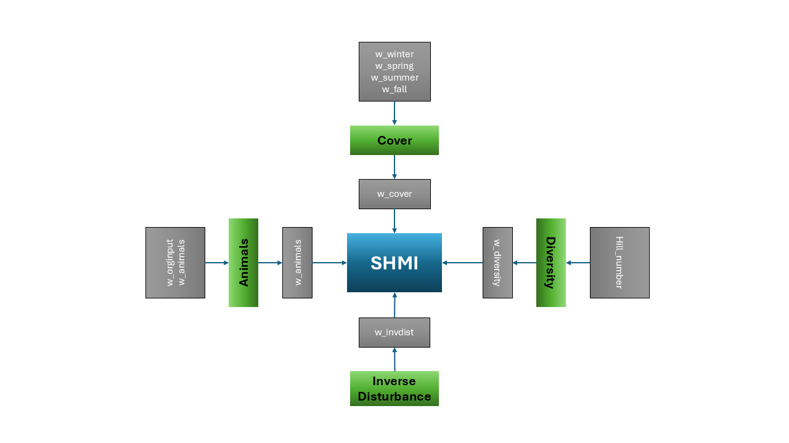

A theory‑driven framework for a management‑based soil health index.

This vignette complements the SHMI workflow documentation by explaining the conceptual design, scientific rationale, and theoretical foundations of the Soil Health Management Index (SHMI).

## 1. Why SHMI Exists

The Soil Health Management Index (SHMI) was created to fill a gap between two worlds:

- management‑based soil health frameworks, which emphasize decisions and practices  
- measurement‑based soil health frameworks, which emphasize biological or chemical indicators  

SHMI is intentionally not a latent variable model, not a covariance‑driven index, and not an outcome‑optimized score. Instead, it is a designed, portable, theory‑aligned index that encodes management principles directly into its structure.

SHMI’s purpose is to provide:

- a transparent, reproducible representation of management intensity  
- a stable index that does not change with every new dataset  
- a tool that can be validated against soil health outcomes without being derived from them  

This separation between design and validation is central to SHMI’s philosophy.

---

## 2. Conceptual Architecture

SHMI is built from four sub‑indices, each representing a major dimension of soil health management:

- Organic Inputs  
- Cover  
- Diversity  
- Inverse Disturbance  

These represent widely recognized levers for improving soil function:

- organic matter additions  
- continuous living cover  
- plant diversity  
- reduced disturbance  

These pillars align with NRCS guidance, soil health literature, and regenerative agriculture frameworks.

---

## 3. Tunable Parameters and Design Space

SHMI includes tunable parameters that allow researchers to explore alternative conceptual designs without altering the underlying philosophy:

- weights for each sub‑index  
- seasonal cover weights  
- diversity metric choice (Hill number)  
- maximum allowable disturbance (stir cap)  

These parameters define a **design space**, not a data‑driven optimization problem.

### Bayesian Optimization as a Design Tool

Bayesian optimization can be used to explore this design space, but SHMI is not “fit” to outcomes. Optimization helps identify conceptually coherent parameter sets that align with soil health theory.

---

## 4. Diagram: SHMI Design Structure

{alt="Diagram showing SHMI design structure"}

Interpretation:

- Grey boxes represent tunable settings  
- Green boxes represent sub‑indices  

The diagram illustrates how tunable parameters influence sub‑indices and how sub‑indices combine into SHMI.

---

## 5. What SHMI Is Not

SHMI explicitly avoids:

- latent variable modeling  
- PCA, factor analysis, or covariance‑based weighting  
- machine‑learned or outcome‑optimized indices  
- site‑specific calibration  
- black‑box transformations  

SHMI is a portable, theory‑driven index, not a statistical artifact.

---

## 6. Relationship to Soil Health

SHMI is not a proxy for soil health.  
It is a **predictor** of soil health outcomes, grounded in management theory.

This distinction matters:

- SHMI is designed from management principles  
- Soil health is measured from biological, chemical, and physical indicators  
- Validation tests whether the design aligns with observed outcomes  

This preserves conceptual clarity and prevents circular reasoning.

---

## 7. Validation Philosophy

Validation is performed after SHMI is constructed, using independent soil health datasets.

Validation asks:

- Does SHMI correlate with soil health indicators?  
- Does it predict biological or functional outcomes?  
- Does it behave consistently across regions and systems?  

Because SHMI is not tuned to outcomes, validation is a genuine test of theory.

---

## 8. Summary

SHMI is:

- a designed index  
- grounded in management theory  
- built from four sub‑indices  
- parameterized through tunable conceptual settings  
- validated against independent soil health data  

This conceptual design ensures SHMI remains transparent, portable, and scientifically defensible.

---

For the full SHMI workflow, see the *SHMI Overview* article.
